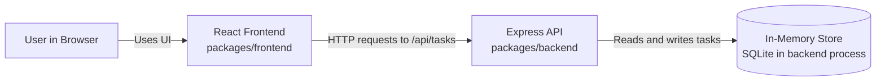
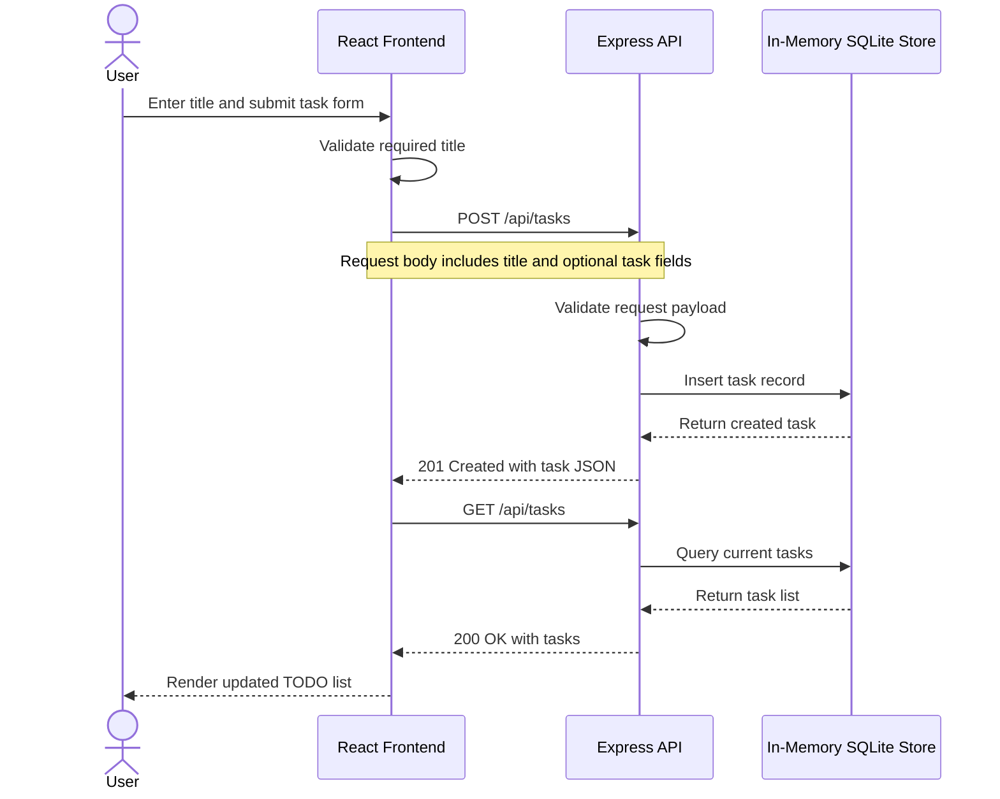

# Cloud Architecture Overview

This monorepo currently runs as a simple local application stack with a React frontend, an Express API, and an in-memory SQLite-backed store inside the backend process.

## System Context

## Create TODO Sequence

## Notes

- The frontend is a React application in packages/frontend.
- The backend is an Express application in packages/backend.
- Task data is stored in an in-memory SQLite database inside the backend process.
- The current architecture is local and ephemeral rather than persistent cloud infrastructure.